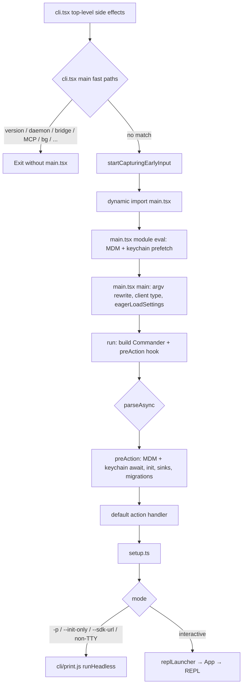

# 01 — System Overview

## 1. Architecture Layers

Claude Code follows a layered architecture with distinct concerns separated into modules. The layers stack from high-level entry points down to infrastructure:

```
┌─────────────────────────────────────────────────────────────────┐
│                        ENTRY LAYER                               │
│  main.tsx, entrypoints/init.ts, entrypoints/cli.tsx,             │
│  entrypoints/mcp.ts, bootstrap/state.ts                          │
│  CLI option parsing, mode dispatch, global state init            │
└─────────────────────────────┬───────────────────────────────────┘
                              │
┌─────────────────────────────▼───────────────────────────────────┐
│                      CORE ENGINE LAYER                           │
│  QueryEngine.ts, query.ts, Tool.ts, Task.ts,                     │
│  commands.ts, tools.ts, tasks.ts                                 │
│  Conversation loop, tool dispatch, command registry, task mgmt   │
└─────────────────────────────┬───────────────────────────────────┘
                              │
┌─────────────────────────────▼───────────────────────────────────┐
│                      SERVICES LAYER                              │
│  services/api/, services/mcp/, services/analytics/,              │
│  services/compact/, services/lsp/, services/plugins/             │
│  API communication, MCP protocol, analytics, compaction          │
└─────────────────────────────┬───────────────────────────────────┘
                              │
┌─────────────────────────────▼───────────────────────────────────┐
│                     EXTENSION LAYER                              │
│  tools/ (40+ tools), commands/ (110+ commands),                  │
│  skills/, plugins/, hooks/                                       │
│  Extensible toolset, slash commands, skills, React hooks         │
└─────────────────────────────┬───────────────────────────────────┘
                              │
┌─────────────────────────────▼───────────────────────────────────┐
│                        UI LAYER                                  │
│  components/ (389 files), screens/ (REPL, Doctor, Resume),      │
│  ink/ (custom Ink fork, 96 files), keybindings/                  │
│  Terminal UI widgets, interaction handling, rendering engine     │
└─────────────────────────────┬───────────────────────────────────┘
                              │
┌─────────────────────────────▼───────────────────────────────────┐
│                   INFRASTRUCTURE LAYER                           │
│  utils/ (254+ files), constants/, types/, state/,                │
│  bridge/, cli/, server/, remote/, migrations/                    │
│  File I/O, config, auth, git, sandbox, MCP transport, etc.      │
└─────────────────────────────────────────────────────────────────┘
```

### Layer Responsibilities

**Entry Layer**: The outermost shell. `entrypoints/cli.tsx` is the first executable — it handles fast-path dispatch (version, daemon, bridge, MCP helpers, etc.) before dynamically loading `main.tsx`. `main.tsx` builds the Commander.js program (60+ options) and dispatches into interactive REPL mode, headless batch mode (`-p`), SDK mode, direct-connect, or subcommands. `entrypoints/init.ts` runs from the Commander `preAction` hook (after auth/config gates). `bootstrap/state.ts` is a massive singleton (1,758 lines) holding all session-scoped global state.

**Core Engine Layer**: The heart of Claude Code. `QueryEngine.ts` (1,295 lines) wraps the conversation loop and manages sessions. `query.ts` (1,729 lines) is the actual query-loop implementation — constructing API requests, processing streaming responses, dispatching tool use blocks, handling compaction triggers, and managing context budget. `Tool.ts` defines the `Tool` interface and `ToolUseContext`. `commands.ts` and `tools.ts` are registries that discover, lazy-import, and filter tools/commands by feature flags and context.

**Services Layer**: Backend integrations. `services/api/` communicates with Anthropic's API (fetch with retry, usage tracking, error handling). `services/mcp/` implements the Model Context Protocol client with config parsing, OAuth flows, and server management. `services/analytics/` integrates Statsig and GrowthBook for telemetry and feature flagging. `services/compact/` manages context compaction (auto, reactive, cached micro-compact).

**Extension Layer**: The extensible capabilities of Claude Code. The `tools/` directory contains 40+ tool implementations (BashTool, FileEditTool, AgentTool, WebFetchTool, etc.). The `commands/` directory has 110+ slash-command implementations. `skills/` and `plugins/` provide higher-level extension mechanisms. `hooks/` contains React hooks used by UI components.

**UI Layer**: The terminal interface. Built on a custom fork of Ink (React-for-CLI), the UI renders in the terminal using ANSI escape codes and Yoga layout. The `screens/` directory defines the three main views: REPL (main interaction), Doctor (diagnostics), and ResumeConversation (session picker). The `components/` directory contains 389 React components — message rendering, text input, dialogs, status lines, and more.

**Infrastructure Layer**: Foundation utilities and cross-cutting concerns. The `utils/` directory is the largest (564 files, ~180,487 lines), providing everything from auth, config, file state caching, git operations, shell execution, permissions, sandbox management, and plugin loading. The `bridge/` directory implements cross-machine session connectivity (CCR). The `cli/` directory provides structured I/O transport for SDK integrations.

---

## 2. Complete Directory Structure

### `src/` — Root Level (18 files, ~11,972 lines)

The root directory contains the core orchestration files that tie the entire system together. These are not subdirectories — they are the primary entry points and registries:

| File | Lines | Purpose |
|------|-------|---------|
| `main.tsx` | 4,684 | **Primary CLI entry point**. Commander.js setup with 60+ CLI options. Parses args, initializes everything, dispatches into interactive/headless/bridge/daemon modes. Contains feature-gated dead-code elimination imports, migration hooks, and all mode-dispatch logic. |
| `setup.ts` | 477 | **Post-init environment setup**. Called after `init()`. Sets working directory, manages worktrees, initializes file change watchers, captures hook snapshots, processes session start hooks, handles tmux sessions. |
| `QueryEngine.ts` | 1,295 | **Session/query orchestrator**. Wraps the `query()` loop with pre/post processing, session management, memory loading, tool resolution, cost tracking, permission handling, and API error retries. |
| `query.ts` | 1,729 | **Core conversation loop**. Constructs API requests, processes streaming responses, dispatches tool use blocks, manages context compaction (auto/reactive/collapse), handles user interruption, and processes tool results. Feature-gated modules for REACTIVE_COMPACT, CONTEXT_COLLAPSE, TOKEN_BUDGET, HISTORY_SNIP, TEMPLATES, etc. |
| `Tool.ts` | 792 | **Tool interface definition**. Defines `Tool`, `ToolUseContext`, `ToolInputJSONSchema`, `ToolResult`, `ToolCall`, `PromptFunction`, and utility types. Imports permission types, progress types, file state cache, and agent definition types. |
| `commands.ts` | 754 | **Command registry**. Imports all 110+ slash commands (many feature-gated). Exports `getCommands()` which lazily resolves commands, filters by feature flags and context (remote mode, ant-only, KAIROS, etc.). |
| `tools.ts` | 389 | **Tool registry**. Imports all 40+ tool classes (many feature-gated). Exports `getTools()` which lazily resolves tools, filtering by feature flags (PROACTIVE, KAIROS, AGENT_TRIGGERS, etc.). |
| `task.ts` | 125 | **Task type definitions**. Defines `TaskType` (7 variants), `TaskStatus`, `TaskHandle`, `TaskContext`, `TaskStateBase`, and `Task` interface. Includes task ID generation with prefix-based encoding. |
| `tasks.ts` | 39 | **Task registry**. Imports task implementations (LocalShell, LocalAgent, RemoteAgent, Dream). Feature-gated imports for LocalWorkflow and MonitorMcp. |
| `context.ts` | 189 | **System/user context assembly**. Memoized functions `getSystemContext()` (git status snapshot) and `getUserContext()` (CLAUDE.md files, current date). Supports cache-breaking injection for ant debugging. |
| `cost-tracker.ts` | 323 | **Session cost tracking**. Tracks API costs (input/output tokens, cache tokens), tool duration, lines changed. Exports formatting helpers, cost accumulation, session cost persistence. |
| `history.ts` | 464 | **Command history management**. File-based history with paste content deduplication, reverse-line reading, lock-based concurrent access, configurable max items (100). |
| `ink.ts` | 85 | **Ink re-exports wrapper**. Wraps Ink rendering with `ThemeProvider`. Re-exports core Ink components (Box, Text, Button, Link, Ansi, etc.) and hooks for use throughout the codebase. |
| `interactiveHelpers.tsx` | 366 | **Interactive setup utilities**. `showDialog()`, `renderAndRun()`, `exitWithError()`, `exitWithMessage()`, `completeOnboarding()`, `showSetupScreens()`. Central orchestration for the interactive TUI lifecycle. |
| `dialogLaunchers.tsx` | 133 | **Dialog launcher factory functions**. Thin wrappers that dynamically import dialog components (ResumeConversation, SnapshotUpdateDialog, InvalidSettingsDialog, etc.) and wire `done` callbacks. |
| `replLauncher.tsx` | 23 | **REPL launch function**. Dynamically imports `App` and `REPL` components, mounts them via `renderAndRun()`. |
| `projectOnboardingState.ts` | 83 | **Onboarding state machine**. Tracks two-step project onboarding (workspace + CLAUDE.md), manages completion state and seen-count gating. |
| `costHook.ts` | 22 | **Cost display hook**. React `useEffect` that writes total session cost to stdout on process exit (for console billing users). |

### `assistant/` (1 file, 79 lines)
- `sessionHistory.ts` — Assistant/KAIROS mode session history management. Gated behind `feature('KAIROS')`. Part of the dead-code elimination tree — only bundled when the KAIROS flag is enabled.

### `bootstrap/` (1 file, 1,758 lines)
- `state.ts` — **Global session state singleton**. A massive file containing all session-scoped mutable state: session IDs, project roots, CWD, permission modes, model selection, feature flag caches, MCP server lists, agent definitions, tool permission contexts, SDK betas, and hundreds of getter/setter functions. Imported by virtually every module.

### `bridge/` (31 files, ~12,000 lines)
The bridge infrastructure enables Claude Code to connect to remote sessions (CCR — Claude Code Remote). Key files:

- `bridgeMain.ts` — Primary bridge mode entry, handles `--connect`, `--session-id`, `--continue` flags
- `bridgeEnabled.ts` — Feature-gated bridge capability checks (`feature('BRIDGE_MODE')`)
- `initReplBridge.ts` — Initializes the REPL bridge for remote session attachment
- `remoteBridgeCore.ts` — Core remote bridge protocol and message handling
- `replBridge.ts` / `replBridgeHandle.ts` / `replBridgeTransport.ts` — REPL bridge transport layer
- `bridgeApi.ts` / `bridgeMessaging.ts` / `bridgeUI.ts` — Bridge API, messaging protocol, UI integration
- `bridgePermissionCallbacks.ts` — Permission handling over bridge transport
- `bridgeConfig.ts` / `envLessBridgeConfig.ts` — Bridge configuration (env-based and env-less)
- `codeSessionApi.ts` / `sessionRunner.ts` / `createSession.ts` — Session lifecycle over bridge
- `inboundMessages.ts` / `inboundAttachments.ts` — Inbound message/attachment processing
- `capacityWake.ts` — Wake-on-connect capacity management
- `jwtUtils.ts` — JWT-based authentication for bridge sessions
- `pollConfig.ts` / `pollConfigDefaults.ts` — Polling-based config synchronization
- `trustedDevice.ts` — Trusted device registration
- `flushGate.ts` — Output flush gating for bridge sessions
- `sessionIdCompat.ts` — Session ID format compatibility
- `bridgeDebug.ts` / `debugUtils.ts` — Bridge debugging utilities
- `bridgePointer.ts` — Pointer/selection synchronization
- `types.ts` — Bridge-specific type definitions
- `workSecret.ts` — Work secret management for bridge auth

### `buddy/` (6 files, 1,253 lines)
Animated companion sprite/Tamagotchi system:
- `companion.ts` — Buddy companion logic
- `CompanionSprite.tsx` — Animated sprite rendering component
- `sprites.ts` — Sprite definitions and frame data
- `prompt.ts` — Buddy-aware prompt additions
- `types.ts` — Buddy type definitions
- `useBuddyNotification.tsx` — Buddy notification hook

### `cli/` (19 files, ~12,355 lines)
CLI transport layer for structured I/O and SDK integration:
- `exit.ts` — Graceful exit handling
- `print.ts` — Structured output printing
- `ndjsonSafeStringify.ts` — NDJSON-safe serialization
- `remoteIO.ts` — Remote I/O handling
- `structuredIO.ts` — Structured I/O message protocol
- `update.ts` — CLI update handling
- `handlers/` — Subcommand handlers:
  - `agents.ts` — Agent management CLI
  - `auth.ts` — Authentication CLI
  - `autoMode.ts` — Auto mode management
  - `mcp.tsx` — MCP server management
  - `plugins.ts` — Plugin management
  - `util.tsx` — Utility handlers
- `transports/` — Transport implementations:
  - `ccrClient.ts` — CCR client transport
  - `HybridTransport.ts` — Hybrid transport combining multiple channels
  - `SerialBatchEventUploader.ts` — Batch event upload
  - `SSETransport.ts` — Server-Sent Events transport
  - `transportUtils.ts` — Transport factory (`getTransportForUrl`: SSE v2, hybrid POST, or WebSocket)
  - `WebSocketTransport.ts` — WebSocket transport
  - `WorkerStateUploader.ts` — Worker-based state upload

### `commands/` (189 files, 26,507 lines — 110 command implementations + 79 .tsx UI modules)
All slash-command implementations. Each command typically lives in its own subdirectory with an `index.ts(x)` entry point. Commands are lazily imported and feature-gated. Key commands:

- `init.ts` / `init-verifiers.ts` — Initialize project with CLAUDE.md
- `compact/` — Manual context compaction
- `config/` — Configuration management
- `context/` — Context inspection and visualization
- `cost/` — Cost display
- `doctor/` — Diagnostic/health check
- `help/` — Help system
- `ide/` — IDE integration commands
- `login/` / `logout/` — Authentication
- `mcp/` — MCP server management
- `memory/` — Memory file management
- `model/` — Model selection
- `permissions/` — Permission mode management
- `release-notes/` — Release notes display
- `resume/` — Session resume
- `review/` / `review.ts` — Code review (PR, security, bug hunter)
- `session/` — Session management
- `skills/` — Skill management
- `status/` — Status display
- `tasks/` — Task list management
- `teleport/` — Remote session teleportation
- `commit.ts` / `commit-push-pr.ts` — Git commit and PR creation
- `diff.ts` — Diff display
- `add-dir/` — Additional directory configuration
- `vim/` — Vim mode toggle
- `voice/` — Voice mode toggle
- `bridge/` — Bridge/session controls (feature-gated: BRIDGE_MODE)
- `proactive.ts` — Proactive agent controls (feature-gated: PROACTIVE/KAIROS)
- `brief.ts` — Brief mode controls (feature-gated: KAIROS/KAIROS_BRIEF)
- `assistant/` — Assistant mode controls (feature-gated: KAIROS)
- `bughunter/` — Bug hunter mode
- `ultraplan.tsx` — Ultraplan feature (feature-gated: ULTRAPLAN)

### `components/` (389 files, ~80,127 lines)
React/Ink UI components — the largest component directory. Major subdirectories and files:

- **Core UI**: `App.tsx` — Main application component shell. `Messages.tsx` / `Message.tsx` / `MessageRow.tsx` / `MessageResponse.tsx` — Message rendering pipeline. `TextInput.tsx` / `BaseTextInput.tsx` / `VimTextInput.tsx` — Text input variants.
- **REPL chrome**: `StatusLine.tsx`, `Stats.tsx`, `TokenWarning.tsx`, `MemoryUsageIndicator.tsx`, `EffortIndicator.ts`, `ThinkingToggle.tsx`, `Spinner.tsx`
- **Dialogs**: `AutoModeOptInDialog.tsx`, `BypassPermissionsModeDialog.tsx`, `BridgeDialog.tsx`, `CostThresholdDialog.tsx`, `InvalidSettingsDialog.tsx`, `InvalidConfigDialog.tsx`, `IdleReturnDialog.tsx`, `RemoteEnvironmentDialog.tsx`, `WorktreeExitDialog.tsx`, `TeleportRepoMismatchDialog.tsx`, `TeleportResumeWrapper.tsx`, `TrustDialog/`, `ChannelDowngradeDialog.tsx`
- **Design system**: `design-system/` — ThemedBox, ThemedText, ThemeProvider, color tokens
- **Tool rendering**: `FileEditToolDiff.tsx`, `FileEditToolUpdatedMessage.tsx`, `BashModeProgress.tsx`, `AgentProgressLine.tsx`, `ToolUseLoader.tsx`, `FallbackToolUseErrorMessage.tsx`
- **Diff display**: `diff/`, `StructuredDiff.tsx`, `StructuredDiff/`, `StructuredDiffList.tsx`
- **Markdown**: `Markdown.tsx`, `MarkdownTable.tsx`, `HighlightedCode.tsx`, `HighlightedCode/`
- **Search/History**: `GlobalSearchDialog.tsx`, `HistorySearchDialog.tsx`, `SearchBox.tsx`, `MessageSelector.tsx`
- **MCP**: `mcp/`, `MCPServerApprovalDialog.tsx`, `MCPServerMultiselectDialog.tsx`
- **Wizard**: `wizard/` — Setup wizard components
- **Passes**: `Passes/` — Pass management UI
- **Settings**: `Settings/` — Settings UI components
- **Dev**: `DevBar.tsx`, `DevChannelsDialog.tsx`, `DiagnosticsDisplay.tsx`, `SentryErrorBoundary.ts`
- **Misc**: `Agents/`, `AutoUpdater.tsx`, `NativeAutoUpdater.tsx`, `PackageManagerAutoUpdater.tsx`, `LogoV2/`, `HelpV2/`, `Feedback.tsx`, `FeedbackSurvey/`, `ContextVisualization.tsx`, `ContextSuggestions.tsx`, `PromptInput/`, `TagTabs.tsx`, `TaskListV2.tsx`, `tasks/`, `VirtualMessageList.tsx`, `FullscreenLayout.tsx`
- **Integration**: `ClaudeInChromeOnboarding.tsx`, `DesktopHandoff.tsx`, `DesktopUpsell/`, `IdeOnboardingDialog.tsx`, `IdeAutoConnectDialog.tsx`, `IdeStatusIndicator.tsx`, `ShowInIDEPrompt.tsx`
- **Permissions**: `permissions/` — Permission-related UI
- **Sandbox**: `sandbox/` — Sandbox violation UI
- **Memory**: `memory/` — Memory-related UI
- **Skills**: `skills/` — Skill-related UI
- **Teams**: `teams/` — Team/swarm-related UI

### `constants/` (21 files, ~2,360 lines)
Magic values and configuration constants:
- `prompts.ts` (914 lines) — **System prompt assembly**. The largest constants file. Assembles the system prompt from many sections: identity, tools, environment, skills, memory, git, sandbox, proactive/brief/assistant modes (feature-gated), token budget, output styles, etc.
- `common.ts` — Shared constants (date formatting, etc.)
- `product.ts` — Product URLs and endpoint configuration
- `oauth.ts` — OAuth configuration constants
- `system.ts` / `systemPromptSections.ts` — System prompt section identifiers
- `tools.ts` / `toolLimits.ts` — Tool-related constants and limits
- `apiLimits.ts` — API rate limiting constants
- `messages.ts` — Message template constants
- `keys.ts` — Key identifiers
- `betas.ts` — Beta feature configuration
- `errorIds.ts` — Error identifier constants
- `outputStyles.ts` — Output style constants
- `files.ts` — File-related constants
- `figures.ts` — ASCII figure constants
- `xml.ts` — XML tag constants (for tool output encoding)
- `github-app.ts` — GitHub App configuration
- `spinnerVerbs.ts` / `turnCompletionVerbs.ts` — UI text constants
- `cyberRiskInstruction.ts` — Security instruction text

### `context/` (9 files, 992 lines)
React context providers for the UI tree:
- `stats.tsx` — Stats store context
- `fpsMetrics.tsx` — FPS metrics context
- `mailbox.tsx` — Mailbox/notification context
- `modalContext.tsx` — Modal dialog stack context
- `notifications.tsx` — Notification definitions
- `overlayContext.tsx` — Overlay display context
- `promptOverlayContext.tsx` — Prompt-level overlay context
- `QueuedMessageContext.tsx` — Queued message context (for async message injection)
- `voice.tsx` — Voice mode context

### `coordinator/` (1 file, 369 lines)
- `coordinatorMode.ts` — Coordinator agent mode implementation. Gated behind `feature('COORDINATOR_MODE')`. Exports `isCoordinatorMode()`, `matchSessionMode()`, `getCoordinatorUserContext()`, and `getCoordinatorSystemPrompt()`. Tool filtering for coordinator mode lives in `utils/toolPool.ts` (`applyCoordinatorToolFilter`). Dead-code eliminated when the feature flag is off.

### `entrypoints/` (8 files, ~4,052 lines)
Program entry points and SDK type definitions:
- `init.ts` — **Post-auth initialization**. Handles trust dialog, telemetry initialization, Managed Settings/Policy Limits loading, GrowthBook refresh, MCP official registry prefetch, Analytics gating, and session environment setup. Called from `main.tsx` after auth is established.
- `cli.tsx` — **Process bootstrap entry point**. Top-level side effects (corepack, CCR heap, ablation baseline), then `main()` fast-path dispatch for version/daemon/bridge/MCP helpers before dynamically importing `main.tsx`. Structured SDK I/O is handled inside `main.tsx` via `cli/print.js`, not here.
- `mcp.ts` — MCP entry point for MCP server startup.
- `agentSdkTypes.ts` — SDK type definitions for external agent API consumers.
- `sandboxTypes.ts` — Sandbox configuration types.
- `sdk/` — SDK integration types and schemas:
  - `coreTypes.ts` — Core SDK types
  - `coreSchemas.ts` — Core SDK Zod schemas
  - `controlSchemas.ts` — Control message schemas

### `hooks/` (104 files, ~17,900 lines)
React hooks for UI behavior and state management. Key hooks:

- **Input handling**: `useTextInput.ts`, `useArrowKeyHistory.tsx`, `useInputBuffer.ts`, `useCommandKeybindings.tsx`, `useGlobalKeybindings.tsx`, `useSearchInput.ts`, `useVimInput.ts`, `useCopyOnSelect.ts`, `useDoublePress.ts`
- **API/Auth**: `useApiKeyVerification.ts`, `useDirectConnect.ts`, `useSSHSession.ts`
- **IDE integration**: `useIDEIntegration.tsx`, `useIdeLogging.ts`, `useIdeSelection.ts`, `useIdeConnectionStatus.ts`, `useIdeAtMentioned.ts`, `useDiffInIDE.ts`
- **Session management**: `useRemoteSession.ts`, `useSessionBackgrounding.ts`, `useTeleportResume.tsx`, `useReplBridge.tsx`, `useAssistantHistory.ts`, `useInboxPoller.ts`
- **Tool/permission**: `useCanUseTool.tsx` → `hasPermissionsToUseTool()` → `toolPermission/` handlers → `components/permissions/PermissionRequest.tsx` dialog queue (types in `types/permissions.ts` + runtime `ToolPermissionContext` in `Tool.ts`)
- **UI behavior**: `useTerminalSize.ts`, `useVirtualScroll.ts`, `useBlink.ts`, `useCancelRequest.ts`, `useElapsedTime.ts`, `useTimeout.ts`, `useAfterFirstRender.ts`, `useMinDisplayTime.ts`, `useExitOnCtrlCD.ts`, `useExitOnCtrlCDWithKeybindings.ts`
- **Features**: `useVoice.ts`, `useVoiceEnabled.ts`, `useVoiceIntegration.tsx`, `useAwaySummary.ts`, `useScheduledTasks.ts`, `useTasksV2.ts`, `useCommandQueue.ts`, `useQueueProcessor.ts`
- **Content**: `usePasteHandler.ts`, `useClipboardImageHint.ts`, `useTurnDiffs.ts`, `useDiffData.ts`, `useFileHistorySnapshotInit.ts`, `useDeferredHookMessages.ts`, `useLogMessages.ts`
- **Settings/Config**: `useSettings.ts`, `useSettingsChange.ts`, `useDynamicConfig.ts`, `useSkillsChange.ts`, `useMainLoopModel.ts`
- **Plugin/Extension**: `useManagePlugins.ts`, `useMergedClients.ts`, `useMergedCommands.ts`, `useMergedTools.ts`, `usePluginRecommendationBase.tsx`, `useLspPluginRecommendation.tsx`
- **Notifications**: `useNotifyAfterTimeout.ts`, `useUpdateNotification.ts`, `useOfficialMarketplaceNotification.tsx`, `useIssueFlagBanner.ts`, `useSkillImprovementSurvey.ts`
- **Misc**: `useClaudeCodeHintRecommendation.tsx`, `useChromeExtensionNotification.tsx`, `useMemoryUsage.ts`, `usePrStatus.ts`, `usePromptsFromClaudeInChrome.tsx`, `usePromptSuggestion.ts`, `useSwarmInitialization.ts`, `useSwarmPermissionPoller.ts`, `useBackgroundTaskNavigation.ts`, `useStateRestore.ts`, `useTeammateViewAutoExit.ts`, `useMailboxBridge.ts`, `useHistorySearch.ts`
- **Subdirectories**: `notifs/` — Notification hooks. `toolPermission/` — Tool permission hooks.

### `ink/` (96 files, ~18,162 lines)
A custom fork of the [Ink](https://github.com/vadimdemedes/ink) library — React renderer for interactive CLI apps. This is a heavily modified fork with additional features:

- **Renderer core**: `root.ts`, `reconciler.ts`, `renderer.ts`, `instances.ts`, `ink.tsx`
- **Component system**: `components/` — Box, Text, Button, Link, Newline, Spacer, NoSelect, RawAnsi, Ansi, AppContext
- **Layout**: `layout/` — Yoga layout engine integration, flexbox-based terminal layout
- **Rendering pipeline**: `render-node-to-output.ts`, `render-to-screen.ts`, `render-border.ts`, `output.ts`, `screen.ts`, `frame.ts`, `log-update.ts`
- **Terminal I/O**: `termio/` — Raw terminal mode, stdin/stdout handling, mouse input. `terminal.ts`, `terminal-focus-state.ts`, `terminal-querier.ts`, `supports-hyperlinks.ts`
- **Event system**: `events/` — ClickEvent, InputEvent, TerminalFocusEvent, EventEmitter
- **Hooks**: `hooks/` — use-input, use-app, use-stdin, use-interval, use-animation-frame, use-selection, use-terminal-focus, use-terminal-title, use-terminal-viewport, use-tab-status
- **Text processing**: `measure-element.ts`, `measure-text.ts`, `wrap-text.ts`, `wrapAnsi.ts`, `stringWidth.ts`, `widest-line.ts`, `squash-text-nodes.ts`, `bidi.ts`
- **Styling**: `styles.ts`, `colorize.ts`, `tabstops.ts`, `parse-keypress.ts`
- **User interaction**: `focus.ts`, `selection.ts`, `hit-test.ts`, `searchHighlight.ts`
- **Optimization**: `optimizer.ts`, `node-cache.ts`, `line-width-cache.ts`, `get-max-width.ts`
- **Utilities**: `dom.ts`, `constants.ts`, `clearTerminal.ts`, `warn.ts`, `useTerminalNotification.ts`

### `keybindings/` (14 files, ~2,920 lines)
Customizable keybinding system:
- `schema.ts` — Keybinding schema and validation
- `parser.ts` — Keybinding expression parser
- `resolver.ts` — Keybinding conflict resolution
- `defaultBindings.ts` — Default keybinding definitions
- `loadUserBindings.ts` — User-defined keybinding loader
- `KeybindingContext.tsx` — React context for keybinding state
- `KeybindingProviderSetup.tsx` — One-time keybinding setup provider
- `useKeybinding.ts` — Keybinding registration hook
- `useShortcutDisplay.ts` — Shortcut display hook
- `shortcutFormat.ts` — Shortcut formatting utilities
- `match.ts` — Keybinding matching logic
- `template.ts` — Keybinding template values
- `reservedShortcuts.ts` — Reserved/system shortcuts
- `validate.ts` — Validation utilities

### `memdir/` (8 files, 1,635 lines)
Memory directory system — manages CLAUDE.md and memory files:
- `memdir.ts` — Memory directory loading: scans cwd for CLAUDE.md, CLAUDE.local.md, and agent-specific memory files. Feature-gated team memory support (`feature('TEAMMEM')`). KAIROS-gated daily log prompts.
- `paths.ts` — Memory file path resolution
- `findRelevantMemories.ts` — Memory relevance ranking
- `memoryTypes.ts` — Memory file type definitions
- `memoryScan.ts` — File scanning for memory content
- `memoryAge.ts` — Memory age tracking
- `teamMemPaths.ts` — Team memory path resolution (feature-gated)
- `teamMemPrompts.ts` — Team memory prompt assembly (feature-gated)

### `migrations/` (11 files, 550 lines)
Config migration scripts (invoked from `main.tsx` `preAction` after `init()`, not at import time):
- `migrateAutoUpdatesToSettings.ts` — Move auto-update pref to settings
- `migrateBypassPermissionsAcceptedToSettings.ts` — Move bypass to settings
- `migrateEnableAllProjectMcpServersToSettings.ts` — MCP server setting migration
- `migrateFennecToOpus.ts` — Model name migration
- `migrateLegacyOpusToCurrent.ts` — Legacy model migration
- `migrateOpusToOpus1m.ts` — Opus model variant migration
- `migrateSonnet1mToSonnet45.ts` / `migrateSonnet45ToSonnet46.ts` — Model naming migrations
- `migrateReplBridgeEnabledToRemoteControlAtStartup.ts` — Setting key rename
- `resetAutoModeOptInForDefaultOffer.ts` — Auto-mode opt-in reset (feature-gated: TRANSCRIPT_CLASSIFIER)
- `resetProToOpusDefault.ts` — Default model reset

### `moreright/` (1 file, 25 lines)
- `useMoreRight.tsx` — "MoreRight" feature hook

### `native-ts/` (4 files, ~3,836 lines)
Native-compiled TypeScript modules for performance-critical operations:
- `color-diff/` — Fast colorized diff rendering using native code
- `file-index/` — Native file system indexing
- `yoga-layout/` — Yoga layout engine bindings (C++/WASM compiled to native)

### `outputStyles/` (1 file, 90 lines)
- `loadOutputStylesDir.ts` — Output style configuration loader. Reads JSON style definitions from the filesystem.

### `plugins/` (2 files, 163 lines)
Plugin system entry points:
- `builtinPlugins.ts` — Built-in plugin registration
- `bundled/` — Bundled plugin definitions

### `query/` (4 files, 603 lines)
Query configuration and lifecycle:
- `config.ts` — Query configuration constants
- `deps.ts` — Query dependency injection types
- `stopHooks.ts` — Post-conversation hooks (memory extraction, job classification, MCP cleanup). Feature-gated for EXTRACT_MEMORIES, TEMPLATES, CHICAGO_MCP.
- `tokenBudget.ts` — Token budget tracking for query lifecycle

### `remote/` (4 files, 1,020 lines)
Remote session management infrastructure:
- `RemoteSessionManager.ts` — Remote session lifecycle manager
- `SessionsWebSocket.ts` — WebSocket transport for remote sessions
- `remotePermissionBridge.ts` — Permission forwarding for remote sessions
- `sdkMessageAdapter.ts` — SDK message format adapter for remote

### `schemas/` (1 file, 211 lines)
- `hooks.ts` — JSON Schema definitions for hook event configurations

### `screens/` (3 files, 5,704 lines)
Top-level screen components — the three primary views of the application:
- `REPL.tsx` — The main REPL screen. The largest UI component. Handles message rendering, input management, keybinding dispatch, session lifecycle, cost display, and the core interaction loop.
- `Doctor.tsx` — Diagnostic/health check screen. Runs system checks and displays results.
- `ResumeConversation.tsx` — Session resume selector. Lists previous sessions with search, filtering, and preview.

### `server/` (3 files, 358 lines)
Direct-connect client-side session wiring for IDE integration (cc:// URLs):
- `directConnectManager.ts` (213 lines) — `DirectConnectSessionManager` WebSocket client; forwards SDK messages, handles `can_use_tool` permission requests, sends interrupts
- `createDirectConnectSession.ts` (88 lines) — POST `${serverUrl}/sessions`, returns `DirectConnectConfig`
- `types.ts` (57 lines) — `connectResponseSchema`, `ServerConfig`, `SessionState`, session index types

### `services/` (130 files, 53,683 lines)
The service layer — backend integrations and business logic:

- **API** (`api/`): Anthropic API communication. `claude.ts` (fetch with retry), `withRetry.ts` (retry logic), `errors.ts` (API error classification), `bootstrap.ts` (initial data fetch), `filesApi.ts` (file upload/download), `logging.ts` (API usage logging), `referral.ts` (referral/prefetch), `grove.ts` (Grove feature qualification)
- **MCP** (`mcp/`): Model Context Protocol. `client.ts` (MCP client lifecycle), `config.ts` (MCP server config parsing), `types.ts` (MCP type definitions), `officialRegistry.ts` (official MCP registry), `claudeai.ts` (Claude.ai MCP integration), `utils.ts` (MCP utilities), `mcpServerApproval.tsx` (server approval UI), `xaaIdpLogin.ts` (enterprise IDP login)
- **Analytics** (`analytics/`): Statsig and GrowthBook integration. `growthbook.ts` (feature flag evaluation), `config.ts` (analytics configuration), `index.ts` (event logging), `sink.ts` (analytics gate initialization)
- **Compact** (`compact/`): Context compaction. `autoCompact.ts` (trigger detection), `compact.ts` (compaction execution), `reactiveCompact.ts` (feature-gated), `cachedMCConfig.ts` (feature-gated cached config)
- **Plugin management** (`plugins/`): Plugin CLI commands (`pluginCliCommands.ts`), plugin lifecycle
- **Policy limits** (`policyLimits/`): Enterprise policy enforcement
- **Remote settings** (`remoteManagedSettings/`): MDM/managed settings
- **LSP** (`lsp/`): Language Server Protocol integration
- **Memory** (`SessionMemory/`, `extractMemories/`): Session memory extraction and persistence
- **Tools** (`tools/`): Service-level tool utilities
- **Other**: `internalLogging.ts` (ant diagnostics), `diagnosticTracking.ts` (error tracking), `rateLimitMocking.ts`/`rateLimitMessages.ts` (rate limit simulation), `mockRateLimits.ts` (testing utilities), `claudeAiLimits.ts`/`claudeAiLimitsHook.ts` (usage limits), `tokenEstimation.ts`, `tips/` (tip system), `toolUseSummary/` (tool summary generation), `vcr.ts` (test recording), `voice.ts`/`voiceStreamSTT.ts`/`voiceKeyterms.ts` (voice features), `awaySummary.ts` (away-mode summary), `settingsSync/`, `teamMemorySync/`, `PromptSuggestion/`, `MagicDocs/`, `autoDream/`, `notifier.ts`, `preventSleep.ts`, `AgentSummary/`

### `skills/` (20 files, ~3,536 lines)
Skill system — a higher-level extension mechanism above tools:
- `bundledSkills.ts` / `bundled/` — Built-in skill definitions
- `loadSkillsDir.ts` — File-system based skill loader
- `mcpSkillBuilders.ts` — MCP-to-skill bridge

### `state/` (6 files, 1,144 lines)
Central state management:
- `AppState.tsx` — AppState React context provider
- `AppStateStore.ts` — AppState type definition (the central state shape) with `getDefaultAppState()`
- `store.ts` — Zustand-like state store with immutable update pattern
- `selectors.ts` — State selector functions
- `onChangeAppState.ts` — State change observer/subscription
- `teammateViewHelpers.ts` — State helpers for teammate view

### `tasks/` (12 files, ~3,082 lines)
Asynchronous task execution system with PID-like lifecycle:
- `DreamTask/` — Dream mode task execution
- `LocalShellTask/` — Local bash/shell task execution
- `LocalAgentTask/` — Local sub-agent execution
- `RemoteAgentTask/` — Remote agent task execution
- `InProcessTeammateTask/` — In-process teammate task
- `LocalMainSessionTask.ts` — Main session task abstraction
- `pillLabel.ts` — Task label rendering
- `stopTask.ts` — Task termination logic
- `types.ts` — Task-related type definitions

### `tools/` (184 files, 50,863 lines — 149 .ts + 35 .tsx)
All tool implementations — the capabilities Claude Code can invoke:

- **File tools**: `FileReadTool/`, `FileWriteTool/`, `FileEditTool/`
- **Search tools**: `GlobTool/`, `GrepTool/`, `ToolSearchTool/`
- **Shell tools**: `BashTool/`, `PowerShellTool/`
- **Web tools**: `WebFetchTool/`, `WebSearchTool/`
- **Agent tools**: `AgentTool/` (sub-agent delegation), `TeamCreateTool/`, `TeamDeleteTool/`, `SendMessageTool/`
- **Task tools**: `TaskCreateTool/`, `TaskListTool/`, `TaskGetTool/`, `TaskUpdateTool/`, `TaskStopTool/`, `TaskOutputTool/`
- **Plan mode tools**: `EnterPlanModeTool/`, `ExitPlanModeTool/`
- **Worktree tools**: `EnterWorktreeTool/`, `ExitWorktreeTool/`
- **MCP tools**: `MCPTool/`, `McpAuthTool/`, `ListMcpResourcesTool/`, `ReadMcpResourceTool/`
- **Skill tools**: `SkillTool/`, `BriefTool/`
- **User interaction**: `AskUserQuestionTool/`, `TodoWriteTool/`
- **Editor**: `NotebookEditTool/`, `LSPTool/`
- **Infrastructure**: `SyntheticOutputTool/`, `SleepTool/`, `ConfigTool/`
- **Feature-gated**: `REPLTool/` (ant-only), `SuggestBackgroundPRTool/` (ant-only), `RemoteTriggerTool/` (AGENT_TRIGGERS_REMOTE), `ScheduleCronTool/` (AGENT_TRIGGERS), `MonitorTool/` (MONITOR_TOOL), `SendUserFileTool/` (KAIROS), `PushNotificationTool/` (KAIROS), `SubscribePRTool/` (KAIROS_GITHUB_WEBHOOKS), `TungstenTool/`
- **Shared**: `shared/` — Shared tool utilities. `utils.ts`

### `types/` (11 files, ~3,221 lines)
Shared TypeScript type definitions:
- `command.ts` — Command type definitions
- `hooks.ts` — Hook event types
- `ids.ts` — ID types (SessionId, AgentId, etc.)
- `logs.ts` — Logging type definitions
- `message.ts` — Message type definitions
- `permissions.ts` — Permission type definitions
- `plugin.ts` — Plugin type definitions
- `textInputTypes.ts` — Text input type definitions
- `tools.ts` — Tool progress type definitions
- `generated/` — Auto-generated types:
  - `events_mono/` — Event schema generated types
  - `google/` — Google API generated types

### `upstreamproxy/` (2 files, 740 lines)
CCR container-side upstream MITM proxy wiring (fail-open):
- `upstreamproxy.ts` (285 lines) — `initUpstreamProxy()`, `getUpstreamProxyEnv()`; reads session token, builds CA bundle, starts relay, sets `HTTPS_PROXY`/`SSL_CERT_FILE`
- `relay.ts` (455 lines) — Local CONNECT→WebSocket relay; `encodeChunk`/`decodeChunk`, `startUpstreamProxyRelay()`

### `utils/` (564 files, ~180,487 lines)
The largest utility directory. Organized by domain:

- **Auth**: `auth.ts`, `authPortable.ts`, `authFileDescriptor.ts`, `secureStorage/`
- **Config**: `config.ts`, `configConstants.ts`, `settings/`, `cliArgs.ts`
- **File system**: `file.ts`, `fileStateCache.ts`, `fileHistory.ts`, `fileRead.ts`, `fileReadCache.ts`, `filePersistence/`, `fsOperations.ts`, `fileOperationAnalytics.ts`
- **Git**: `git.ts`, `git/`, `gitDiff.ts`, `gitSettings.ts`, `github/`, `ghPrStatus.ts`, `githubRepoPathMapping.ts`, `detectRepository.ts`
- **Shell**: `Shell.ts`, `shell/`, `ShellCommand.ts`, `shellConfig.ts`, `execFileNoThrow.ts`, `execFileNoThrowPortable.ts`, `execSyncWrapper.ts`, `subprocessEnv.ts`
- **Permissions**: `permissions/`, `classifierApprovals.ts`, `classifierApprovalsHook.ts`, `autoModeDenials.ts`
- **Plugin system**: `plugins/` (44 files, ~19,000 lines) — Plugin loading, caching, validation, lifecycle, direct downloads, installation, registry
- **MCP**: `mcp/`, `mcpOutputStorage.ts`, `mcpValidation.ts`, `mcpWebSocketTransport.ts`, `mcpInstructionsDelta.ts`
- **Messages**: `messages.ts`, `messages/`, `messagePredicates.ts`, `messageQueueManager.ts`, `controlMessageCompat.ts`
- **Model**: `model/`, `modelCost.ts`, `context.ts`, `thinking.ts`, `tokenBudget.ts`, `tokens.ts`
- **Session**: `sessionStorage.ts`, `sessionStoragePortable.ts`, `sessionRestore.ts`, `sessionStart.ts`, `sessionState.ts`, `sessionActivity.ts`, `sessionEnvironment.ts`, `sessionTitle.ts`, `sessionUrl.ts`, `sessionIngressAuth.ts`, `sessionEnvVars.ts`, `sessionFileAccessHooks.ts`, `conversationRecovery.ts`
- **Swarm/Team**: `swarm/`, `teammate.ts`, `teammateContext.ts`, `teammateMailbox.ts`, `teamDiscovery.ts`, `teamMemoryOps.ts`, `standaloneAgent.ts`, `forkedAgent.ts`, `inProcessTeammateHelpers.ts`, `agentContext.ts`, `agentId.ts`, `agenticSessionSearch.ts`
- **UI**: `ink.ts`, `ansiToPng.ts`, `ansiToSvg.ts`, `asciicast.ts`, `exportRenderer.tsx`, `staticRender.tsx`, `status.tsx`, `statusNoticeDefinitions.tsx`, `statusNoticeHelpers.ts`, `CliHighlight.ts`, `displayTags.ts`, `Cursor.ts`, `heatmap.ts`, `highlightMatch.tsx`
- **Process**: `process.ts`, `processUserInput/`, `promptEditor.ts`, `promptShellExecution.ts`, `genericProcessUtils.ts`, `earlyInput.ts`
- **Network**: `api.ts`, `apiPreconnect.ts`, `http.ts`, `proxy.ts`, `browser.ts`
- **Telemetry**: `telemetry/`, `startupProfiler.ts`, `headlessProfiler.ts`, `queryProfiler.ts`, `profilerBase.ts`, `unaryLogging.ts`, `diagLogs.ts`, `log.ts`, `errorLogSink.ts`, `debug.ts`, `debugFilter.ts`, `warningHandler.ts`
- **Skills**: `skills/`, `slashCommandParsing.ts`
- **Other**: `array.ts`, `set.ts`, `uuid.ts`, `hash.ts`, `crypto.ts`, `withResolvers.ts`, `CircularBuffer.ts`, `bufferedWriter.ts`, `combinedAbortSignal.ts`, `abortController.ts`, `signal.ts`, `sleep.ts`, `timeouts.ts`, `memoize.ts`, `sequential.ts`, `lockfile.ts`, `json.ts`, `jsonRead.ts`, `yaml.ts`, `xml.ts`, `zodToJsonSchema.ts`, `stringUtils.ts`, `truncate.ts`, `words.ts`, `format.ts`, `intl.ts`, `objectGroupBy.ts`, `structuredDiff.ts`, `sanitization.ts`, `environment.ts`, `env.ts`, `envDynamic.ts`, `envUtils.ts`, `envValidation.ts`, `user.ts`, `userAgent.ts`, `diffAnalysis.ts`, `truncateOutput.ts`, and many more

### `vim/` (5 files, 1,343 lines)
Vim-mode keybinding implementation:
- `motions.ts` — Vim motion commands (hjkl, w, b, e, etc.)
- `operators.ts` — Vim operator commands (d, c, y, etc.)
- `textObjects.ts` — Vim text object definitions (iw, aw, etc.)
- `transitions.ts` — Vim state machine transitions
- `types.ts` — Vim mode type definitions

### `voice/` (1 file, 50 lines)
- `voiceModeEnabled.ts` — Voice mode feature gate (`feature('VOICE_MODE')`)

---

## 3. Dependency Map

The module dependency graph flows primarily top-down, with careful management of circular dependencies:

### Primary Dependency Direction

```
entrypoints/cli.tsx
  └── main.tsx (dynamic import when no fast path matches)
        ├── bootstrap/state.ts (global state — imported by nearly everything)
  ├── entrypoints/init.ts
  │     ├── services/analytics/growthbook.ts
  │     ├── services/analytics/sink.ts
  │     ├── services/policyLimits/
  │     ├── services/remoteManagedSettings/
  │     └── services/mcp/officialRegistry.ts
  ├── setup.ts
  │     ├── bootstrap/state.ts
  │     ├── utils/git.ts
  │     ├── utils/config.ts
  │     ├── utils/worktree.ts
  │     └── utils/hooks/fileChangedWatcher.ts
  ├── commands.ts → commands/*.ts
  ├── tools.ts → tools/*.ts
  ├── tasks.ts → tasks/*.ts
  ├── context.ts → utils/claudemd.ts → utils/git.ts
  ├── replLauncher.tsx → components/App.tsx → screens/REPL.tsx
  ├── dialogLaunchers.tsx → components/*
  ├── interactiveHelpers.tsx → keybindings/, components/*
  ├── QueryEngine.ts → query.ts
  │     ├── services/api/claude.ts
  │     ├── services/compact/
  │     ├── utils/messages.ts
  │     ├── utils/api.ts
  │     └── tools/ (tool dispatch)
  ├── bridge/ (conditional)
  │     ├── bridge/bridgeMain.ts
  │     └── bridge/initReplBridge.ts
  └── server/ (conditional)
        └── server/createDirectConnectSession.ts
```

### Key Circular Dependency Breaking Patterns

1. **Lazy requires** (`require()` in function body):
   - `tools.ts` → `TeamCreateTool` → `tools.ts` (broken via getter function)
   - `main.tsx` → `./utils/teammate.js` (requires in getter functions to avoid cycle with AppState.tsx)

2. **Type-only imports** (`import type`):
   - `Tool.ts` imports types from `types/permissions.ts`, `types/tools.ts`, `types/message.ts` to avoid import cycles
   - `QueryEngine.ts` imports types from `state/AppState.ts`, `entrypoints/agentSdkTypes.ts`

3. **Centralized type hubs**:
   - `types/permissions.ts` — Permission types used by tools, utils, and services
   - `types/tools.ts` — Tool progress types used across the stack
   - `bootstrap/state.ts` — Shared mutable state avoids parameter threading

### Module Dependency Categories

| Category | Depends on | Used by |
|----------|-----------|---------|
| `types/` | Nothing (leaf) | Everything |
| `constants/` | `types/`, `utils/model/` | `services/`, `components/`, `tools/` |
| `utils/` | `types/`, `constants/`, `bootstrap/` | Everything |
| `bootstrap/state.ts` | `types/` | Everything |
| `services/` | `utils/`, `types/`, `constants/`, `state/` | `tools/`, `commands/`, `components/`, `hooks/` |
| `tools/` | `Tool.ts`, `utils/`, `services/mcp/` | `tools.ts`, `QueryEngine.ts`, `query.ts` |
| `commands/` | `utils/`, `services/` | `commands.ts`, `components/` |
| `hooks/` | `utils/`, `state/AppState.tsx`, `constants/` | `components/`, `screens/` |
| `ink/` | Nothing (self-contained) | `components/`, `screens/`, `ink.ts` |
| `components/` | `hooks/`, `ink/`, `context/`, `state/`, `utils/` | `screens/`, `main.tsx` |
| `screens/` | `components/`, `hooks/`, `state/`, `ink/` | `replLauncher.tsx` |
| `cli/` | `utils/`, `services/` | `entrypoints/cli.tsx` |
| `bridge/` | `utils/`, `services/`, `hooks/` | `main.tsx` |
| `server/` | `utils/`, `services/` | `main.tsx` |
| `state/` | `types/`, `utils/` | `components/`, `hooks/`, `QueryEngine.ts` |

---

## 4. Startup Flow

The full startup chain is `entrypoints/cli.tsx` → `main.tsx` `main()` → `run()` → Commander `preAction` → default `.action()` → `setup.ts` → REPL or headless path. Bridge/daemon/MCP-helper modes can exit in `cli.tsx` without loading `main.tsx`.



### Phase 0: `entrypoints/cli.tsx` bootstrap (lines 1–302)

**Top-level side effects** (before `main()`): corepack pin fix, CCR `NODE_OPTIONS` heap sizing, optional `ABLATION_BASELINE` env injection (must run before tool module eval).

**`main()` fast-path dispatch** (priority order, each early-returns):
1. `--version` / `-v` / `-V` — zero imports
2. All other paths: load startup profiler (`cli_entry`)
3. `--dump-system-prompt` (`DUMP_SYSTEM_PROMPT`)
4. `--claude-in-chrome-mcp`, `--chrome-native-host`, `--computer-use-mcp` (`CHICAGO_MCP`)
5. `--daemon-worker` (`DAEMON`) — before daemon subcommand
6. `remote-control` / `rc` / `remote` / `sync` / `bridge` (`BRIDGE_MODE`) → `bridgeMain`
7. `daemon` subcommand (`DAEMON`) → `daemonMain`
8. `ps` / `logs` / `attach` / `kill` / `--bg` (`BG_SESSIONS`)
9. `new` / `list` / `reply` (`TEMPLATES`)
10. `environment-runner` (`BYOC_ENVIRONMENT_RUNNER`), `self-hosted-runner` (`SELF_HOSTED_RUNNER`)
11. `--worktree` + `--tmux` fast path
12. `--update` / `--upgrade` → rewrite argv to `update`
13. `--bare` → set `CLAUDE_CODE_SIMPLE=1` early
14. **Fallback**: `startCapturingEarlyInput()` → dynamic `import('../main.js')` → `await cliMain()`

### Phase 1: `main.tsx` module evaluation (lines 1–209)

Before other imports complete:
1. `profileCheckpoint('main_tsx_entry')`
2. `startMdmRawRead()` — MDM subprocesses in parallel with imports
3. `startKeychainPrefetch()` — macOS keychain reads in parallel

Then ~135ms of module evaluation: Commander, React/Ink, feature-gated `require()` blocks (`COORDINATOR_MODE`, `KAIROS`, `TRANSCRIPT_CLASSIFIER`), migration function imports, state/types/utils. Ends with `profileCheckpoint('main_tsx_imports_loaded')`.

### Phase 2: `main.tsx` `main()` (lines 585–856)

Runs after `cli.tsx` loads `main.tsx`:
- Windows security env, warning handler, SIGINT (print mode defers to `print.ts`)
- Argv rewriting for `cc://` (`DIRECT_CONNECT`), `--handle-uri` / URL handler (`LODESTONE`), `assistant` (`KAIROS`), `ssh` (`SSH_REMOTE`)
- Non-interactive detection (`-p`, `--init-only`, `--sdk-url`, non-TTY) → `stopCapturingEarlyInput`, `setIsInteractive`
- Client type + question preview format
- `eagerLoadSettings()` then `await run()` (line 854)

### Phase 3: `run()` — Commander program (lines 884–4513)

Builds Commander with 60+ options and registers **`preAction`** (line 907). Registers subcommands unless `-p` print fast path skips them (lines 3883–3889). Parses via:
- **Print fast path**: `parseAsync` at line **3887** (skips ~65ms subcommand registration)
- **Full path**: subcommands registered, then `parseAsync` at line **4504**

**`preAction` hook** (runs when executing a command, not on `--help`):
1. `await Promise.all([ensureMdmSettingsLoaded(), ensureKeychainPrefetchCompleted()])` (914–915)
2. `await init()` — `entrypoints/init.ts` (916)
3. Set `process.title` (922–924)
4. `initSinks()` (931–934)
5. Wire `--plugin-dir` inline plugins (937–949)
6. `runMigrations()` (950)
7. `void loadRemoteManagedSettings()` + `void loadPolicyLimits()` (957–958)
8. Optional `uploadUserSettingsInBackground()` (`UPLOAD_USER_SETTINGS`, 963–965)

### Phase 4: Default `.action()` handler (lines 1007–3860+)

After `preAction` completes, the default command action runs:
- Permission/tool context, MCP config loading, `getInputPrompt`, `getTools`
- **`await setup()`** from `setup.ts` (dynamic import ~1908, awaited ~1934) — CWD/project root, worktrees, hook snapshots, prefetches; runs in parallel with `getCommands`/`getAgentDefinitions` when worktree is off
- `--init-only`: setup hooks + session-start hooks, then exit
- **Headless** (`isNonInteractiveSession`): MCP connect, then `cli/print.js` `runHeadless()` (~2829)
- **Interactive**: `launchRepl()` → `components/App.tsx` → `screens/REPL.tsx` (~3134+)

Subcommand actions (doctor, mcp, plugin, auth, …) run their own handlers after the same `preAction`; they do not call `setup.ts`.

### Phase 5: Runtime (REPL)

Once in REPL mode:
- `screens/REPL.tsx` mounts → renders input prompt
- User submits prompt → `QueryEngine.ts` creates query
- `query.ts` runs conversation loop → API calls → tool dispatch → result processing
- Compaction triggers auto-compact or context collapse
- Session ends → cost display → history save → process exit

---

## 5. Key Design Patterns

### Registry Pattern
Both commands and tools use a registry pattern with lazy loading:
```typescript
// commands.ts
export function getCommands(): Command[] { ... }
// tools.ts
export function getTools(): { tools: Tool[]; ... } { ... }
```
Registries filter results by feature flags, session mode (ant-only, bridge, daemon), and environment.

### Feature-Gated Dead Code Elimination
The `feature()` function from `bun:bundle` enables compile-time dead code elimination:
```typescript
const module = feature('KAIROS') ? require('./kairos.js') : null
```
When `KAIROS` is not in the bundle's feature set, the entire `require()` and all its imports are eliminated.

### Memoized Context Assembly
System and user context are assembled once and cached for the session lifetime using `lodash-es/memoize()`:
```typescript
export const getSystemContext = memoize(async () => { ... })
export const getUserContext = memoize(async () => { ... })
```
Caches are cleared when system prompt injection changes (ant debugging).

### Immutable State with setState Callbacks
State management follows a React-setState pattern with immutable updates:
```typescript
setAppState((prev: AppState) => ({ ...prev, field: newValue }))
```
The state store (`state/store.ts`) supports selectors and change observers.

### Dynamic Import for Large Components
Screens and dialogs use dynamic `import()` to avoid bundling unused code:
```typescript
// replLauncher.tsx
const { App } = await import('./components/App.js')
const { REPL } = await import('./screens/REPL.js')
```

### Hook-Based Extension
User-defined hooks are loaded from filesystem and invoked at lifecycle points:
- `processSessionStartHooks()` → runs on session start
- `processSetupHooks()` → runs during setup
- Hook events defined in `schemas/hooks.ts`

### Transport Abstraction
The CLI layer abstracts I/O through transport implementations (WebSocket, SSE, in-process, hybrid), enabling SDK, bridge, and direct-connect modes to share the same message protocol.

---

## 6. Technology Stack

| Category | Technology | Version/Notes |
|----------|-----------|---------------|
| **Language** | TypeScript | Strict mode, ESM modules |
| **Runtime** | Bun | Primary runtime, single-file executable builds |
| **Runtime (compat)** | Node.js | 18+ supported |
| **CLI Framework** | Commander.js | @commander-js/extra-typings (typed) |
| **UI Framework** | React | 18.x with hooks and context |
| **TUI Renderer** | Custom Ink fork | `src/ink/` — 96 files, ~18K lines |
| **Layout** | Yoga Layout | C++ engine via `native-ts/yoga-layout/` |
| **Terminal** | Raw ANSI | Manual escape code handling, VT100+ |
| **API Client** | @anthropic-ai/sdk | Official TypeScript SDK |
| **Schema** | Zod v4 | Runtime validation for tools, MCP, hooks |
| **Serialization** | Protocol Buffers | Generated types in `types/generated/` |
| **Feature Flags** | GrowthBook + bun:bundle | Compile-time DCE + runtime eval |
| **Analytics** | Statsig + GrowthBook | Event logging, feature flagging |
| **Keychain** | macOS Keychain + Windows Credential Manager | Native secure storage |
| **MCP** | @modelcontextprotocol/sdk | Official MCP TypeScript SDK |
| **LSP** | vscode-languageserver | Language Server Protocol integration |
| **Code Indexing** | Custom file index | `native-ts/file-index/` |
| **Diff** | Custom color diff | `native-ts/color-diff/` |
| **Git** | Git CLI (exec) | Subprocess git operations |
| **Shell** | Platform-native | bash, powershell, cmd |
| **Build/Bundler** | Bun bundler | Single-file executable with DCE |
| **Formatter** | Prettier | Configured via project settings |
| **Linter** | ESLint | Custom rules, biome-ignore markers |
| **Testing** | Vitest | Unit and integration tests |
| **CI** | GitHub Actions | Standard CI pipeline |
| **Packages** | npm + Bun | Dual package manager support |

---

## 7. Feature Flag System

Claude Code uses a two-tier feature flag system:

### Tier 1: Compile-Time DCE (`bun:bundle`)
The `feature()` function from `bun:bundle` marks code for dead-code elimination at build time. When a feature is not enabled for a bundle target, all `feature('FLAG') ? ... : null` branches and their transitive imports are removed.

This is used for:
- **ANT-ONLY features**: `PROACTIVE`, `KAIROS`, `KAIROS_BRIEF`, `KAIROS_GITHUB_WEBHOOKS`, `COORDINATOR_MODE`, `ULTRAPLAN`, `TORCH`, `UDS_INBOX`, `FORK_SUBAGENT`, `BUDDY`, `AGENT_TRIGGERS`, `AGENT_TRIGGERS_REMOTE`, `MONITOR_TOOL`, `VOICE_MODE`, `WORKFLOW_SCRIPTS`
- **Experimental features**: `REACTIVE_COMPACT`, `CONTEXT_COLLAPSE`, `CACHED_MICROCOMPACT`, `TOKEN_BUDGET`, `EXPERIMENTAL_SKILL_SEARCH`, `TEMPLATES`, `TRANSCRIPT_CLASSIFIER`, `BG_SESSIONS`, `COMMIT_ATTRIBUTION`
- **Infrastructure**: `BRIDGE_MODE`, `DAEMON`, `CHICAGO_MCP`, `CCR_MIRROR`, `CCR_AUTO_CONNECT`, `HISTORY_SNIP`, `TERMINAL_PANEL`

### Tier 2: Runtime GrowthBook
The `services/analytics/growthbook.ts` integration provides runtime feature flag evaluation via GrowthBook SDK. Feature keys can be overridden by environment variables (`CLAUDE_CODE_GROWTHBOOK_OVERRIDE`).

### Complete Feature Flag Catalog

| Flag | Type | Purpose |
|------|------|---------|
| `AGENT_TRIGGERS` | Ant-only | Cron/scheduled agent triggers |
| `AGENT_TRIGGERS_REMOTE` | Ant-only | Remote trigger tool |
| `BG_SESSIONS` | Experimental | Background session support |
| `BRIDGE_MODE` | Infrastructure | Cross-machine bridge sessions (CCR) |
| `BUDDY` | Ant-only | Companion buddy sprite |
| `CACHED_MICROCOMPACT` | Experimental | Cached micro-compact config |
| `CCR_AUTO_CONNECT` | Infrastructure | Auto-connect to CCR sessions |
| `CCR_MIRROR` | Infrastructure | One-way mirror mode for CCR |
| `CHICAGO_MCP` | Infrastructure | Chicago MCP integration path |
| `COMMIT_ATTRIBUTION` | Experimental | Git commit attribution tracking |
| `CONTEXT_COLLAPSE` | Experimental | Context collapse (aggressive compaction) |
| `COORDINATOR_MODE` | Ant-only | Coordinator agent multi-agent orchestration |
| `DAEMON` | Ant-only | Daemon mode (with BRIDGE_MODE) |
| `EXPERIMENTAL_SKILL_SEARCH` | Experimental | Skill search and discovery |
| `EXTRACT_MEMORIES` | Experimental | Extract memories from conversations |
| `FORK_SUBAGENT` | Ant-only | Fork sub-agent capability |
| `HISTORY_SNIP` | Experimental | History snipping for context management |
| `KAIROS` | Ant-only | Assistant/KAIROS proactive agent mode |
| `KAIROS_BRIEF` | Ant-only | Brief/daily summary sub-mode of KAIROS |
| `KAIROS_GITHUB_WEBHOOKS` | Ant-only | GitHub webhook subscription in KAIROS |
| `MONITOR_TOOL` | Ant-only | Background monitoring tool |
| `PROACTIVE` | Ant-only | Proactive agent capabilities |
| `REACTIVE_COMPACT` | Experimental | Reactive context compaction |
| `TEAMMEM` | Experimental | Team memory support |
| `TEMPLATES` | Experimental | Job classification / templates |
| `TERMINAL_PANEL` | Experimental | Terminal panel UI |
| `TOKEN_BUDGET` | Experimental | Token budget tracking |
| `TRANSCRIPT_CLASSIFIER` | Experimental | Transcript classifier for auto-mode |
| `ULTRAPLAN` | Ant-only | Ultraplan feature |
| `VERIFICATION_AGENT` | Experimental | Verification agent for output checking |
| `VOICE_MODE` | Ant-only | Voice input/output mode |
| `WORKFLOW_SCRIPTS` | Ant-only | Workflow script execution |
| `UDS_INBOX` | Ant-only | UDS inbox for peer communication |
| `TORCH` | Ant-only | Torch feature |
| `LODESTONE` | Infrastructure | Lodestone infrastructure |
| `AWAY_SUMMARY` | Experimental | Away-mode summarization |
| `BASH_CLASSIFIER` | Experimental | Bash command classification |
| `BYOC_ENVIRONMENT_RUNNER` | Infrastructure | BYOC environment runner |
| `DUMP_SYSTEM_PROMPT` | Debug | Dump system prompt for debugging |
| `FILE_PERSISTENCE` | Experimental | File persistence layer |
| `HOOK_PROMPTS` | Experimental | Hook-based prompt injection |
| `MESSAGE_ACTIONS` | Experimental | Message action buttons |
| `NATIVE_CLIENT_ATTESTATION` | Infrastructure | Native client attestation |
| `SHOT_STATS` | Debug | Snapshot statistics |
| `SELF_HOSTED_RUNNER` | Infrastructure | Self-hosted runner support |
| `STREAMLINED_OUTPUT` | Experimental | Streamlined output format |
| `WEB_BROWSER_TOOL` | Experimental | Web browser tool |
| `ABLATION_BASELINE` | Debug | Ablation study baseline |
| `COMPACTION_REMINDERS` | Experimental | Compaction reminder messages |
| `CONNECTOR_TEXT` | Experimental | Connector text formatting |
| `DOWNLOAD_USER_SETTINGS` | Infrastructure | Download user settings |
| `HISTORY_PICKER` | Experimental | History picker UI |
| `NEW_INIT` | Experimental | New init flow |
| `QUICK_SEARCH` | Experimental | Quick search feature |
| `SLOW_OPERATION_LOGGING` | Debug | Slow operation logging |
| `MEMORY_SHAPE_TELEMETRY` | Debug | Memory shape telemetry |
| `ULTRATHINK` | Experimental | Ultra thinking mode |
| `IS_LIBC_GLIBC` / `IS_LIBC_MUSL` | Build | Platform detection |

### Feature Flag Usage Pattern
```typescript
import { feature } from 'bun:bundle'

// Dead code elimination: entire require() removed when flag is off
const module = feature('KAIROS')
  ? require('./kairosModule.js')
  : null

// Conditional logic
if (feature('CONTEXT_COLLAPSE') && contextCollapse) {
  // Collapse context
}

// In registries (tools.ts, commands.ts) — filters entire entries
const tools = feature('AGENT_TRIGGERS')
  ? [CronCreateTool, CronDeleteTool, CronListTool]
  : []
```

---

## 8. Key Architectural Decisions

1. **Single-file executable via Bun**: The entire application is bundled into a single binary. This drives the dead-code elimination architecture — ant-only features are stripped from the public build, and experimental features are conditionally included.

2. **Custom Ink fork instead of dependency**: Instead of depending on the npm `ink` package, Claude Code maintains its own fork (~18K lines) in `src/ink/`. This allows deep terminal control, custom layout behavior, and performance optimization not possible with the upstream library.

3. **Registry pattern over directory scanning**: Tools and commands use explicit registry files (`tools.ts`, `commands.ts`) with hardcoded imports rather than filesystem scanning. This enables the DCE system to tree-shake unused tools at build time.

4. **Global state singleton**: `bootstrap/state.ts` (1,758 lines) acts as a global mutable state store, avoiding prop drilling through the component tree. While this is an older pattern, it avoids the complexity of reducers and context providers across 389 components.

5. **Memoization for expensive I/O**: Context assembly, git status, and memory loading use `lodash-es/memoize()` to cache results for the session lifetime, since these values are immutable once computed.

6. **Feature-gated prompt sections**: The system prompt in `constants/prompts.ts` (914 lines) assembles different sections based on feature flags, ensuring the model only receives instructions relevant to the enabled capabilities.

7. **Multiple transport backends**: The CLI layer supports in-process, WebSocket, SSE, and hybrid transports, enabling the same application to serve as REPL, SDK backend, bridge client, daemon, and direct-connect server.
